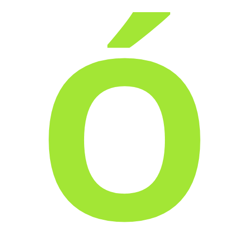

# Órbita - Plataforma de Streaming

<div align="center">



**Todo gira en torno al contenido**

[Ver Proyecto](https://orbitastreaming.netlify.app/) • [Repositorio](https://github.com/ntfran/proyecto-streaming-com25)

</div>

---

## 📋 Descripción

**Órbita** es una plataforma de streaming de películas y series desarrollada como proyecto grupal en RollingCode School. Ofrece una experiencia visual moderna y responsiva, con navegación intuitiva, catálogo dinámico y gestión de suscripciones.

La plataforma combina un diseño sci-fi minimalista con funcionalidades esenciales para un servicio de streaming profesional.

---

## 🎯 Características Principales

✨ **Navbar Sticky** - Navegación fija con buscador interactivo  
🎬 **Carrusel Principal** - Contenido destacado con hero section  
📺 **Catálogo Dinámico** - Películas y series organizadas por categorías  
🎥 **Detalles de Contenido** - Páginas individuales para películas y series  
💳 **Sistema de Suscripción** - 3 planes de pago diferenciados  
🔐 **Modal de Login** - Autenticación 
📱 **Diseño Responsive** - Mobile-first, optimizado para todos los dispositivos  
🌐 **Interfaz Intuitiva** - Navegación clara y efectos visuales modernos

---

## 👥 Equipo de Desarrollo

| Integrante | Responsabilidades |
|------------|------------------|
| **Francisco Sandoval** | Navbar • Footer • Secciones de sugerencias (Home) • Botones de categorías • Página de Suscripción • Página 404 • Mockup y Wireframe |
| **Andrea Reyes** | Hero/Carrusel principal • Página Acerca de Nosotros • Selección de fuentes y paleta de colores |
| **Julio Quispe** | Vista detalle de serie • Página de contacto • Banner de promoción |
| **Agustín Matas** | Páginas de categorías • Vista detalle de película |

---

## 🛠️ Tecnologías Utilizadas

- **HTML5** - Estructura semántica y accesible
- **CSS3** - Estilos modernos con nesting, variables CSS y animaciones
- **Bootstrap 5** - Framework responsive para maquetación
- **Google Fonts** - Tipografías personalizadas (Aldrich, Cairo, Zain)
- **Bootstrap Icons** - Iconografía consistente

**Herramientas:**
- Git & GitHub - Control de versiones
- Netlify - Despliegue y hosting
- VS Code - Editor de código

---

## 🎨 Diseño & Estética

### Paleta de Colores
```css
--text: #e0def5           /* Lavanda claro para textos */
--background: #0f111a     /* Negro profundo para fondo */
--primary: #0d6efd        /* Azul Bootstrap */
--secondary: #23283e      /* Gris oscuro para bordes */
--accent: #a3e635         /* Verde neón para destacados */
```

### Tipografías
- **Logo:** Aldrich (geométrica, tecnológica)
- **Títulos:** Cairo (moderna, legible)
- **Textos:** Zain (serif, sofisticada)

### Filosofía de Diseño
- **Mobile-First:** Desarrollo prioritario para dispositivos pequeños
- **Minimalista:** Interfaz limpia sin elementos innecesarios
- **Sci-Fi:** Inspiración en estética gaming/futurista
- **Accesibilidad:** Contraste adecuado, navegación clara

---

## 📁 Estructura del Proyecto

```
PFM1-STREAMING/
├── css/
│   └── style.css
├── img/
│   ├── acercade/
│   ├── carousel-comprimido/
│   ├── portadas/
│   └── favicon.png
├── pages/
│   ├── acerca-de.html
│   ├── banner.html
│   ├── categoria-1.html
│   ├── categoria-2.html
│   ├── contacto-equipo.html
│   ├── contacto.html
│   ├── detalle-pelicula.html
│   ├── detalle-serie.html
│   ├── error404.html
│   └── suscripcion.html
├── .gitignore
└── index.html
```

---

## 🚀 Secciones Implementadas

### Página Principal (index.html)
- ✅ Navbar con búsqueda y botones de acción
- ✅ Carrusel con contenido destacado
- ✅ Sección "Recomendados para ti" con carrusel
- ✅ Botones de categorías explorables
- ✅ Sección "Series Sugeridas" con progreso de visualización
- ✅ Footer con información y enlaces

### Páginas de Contenido
- ✅ Detalle de película (sinopsis, elenco, duración, calidad)
- ✅ Detalle de serie (capítulos, temporadas, progreso)
- ✅ Categorías (Comedia, Ciencia Ficción, etc.)

### Funcionalidades
- ✅ Modal de login con formulario
- ✅ Página de suscripción con 3 planes
- ✅ Página de contacto con formulario
- ✅ Página "Acerca de nosotros" con equipo
- ✅ Página de error 404 con animación
- ✅ Banner de promoción

---

## 📱 Responsive Design

Optimizado para:
- **Mobile** (320px - 767px)
- **Tablet** (768px - 991px)
- **Desktop** (992px+)

**Características responsivas:**
- Navbar adaptable con menú hamburguesa
- Grillas flexibles que se ajustan al viewport
- Tamaños de fuente escalables con `clamp()`
- Imágenes optimizadas y proporcionales

---

## ✨ Características Técnicas Destacadas

### CSS Moderno
- Nesting nativo de CSS (variables y selectores anidados)
- Variables CSS para tema personalizable
- Animaciones fluidas (transiciones, keyframes)
- Efectos hover y focus interactivos

### Bootstrap 5
- Utilidades nativas para alineación y espaciado
- Sistema de grid responsivo
- Componentes personalizados (navbar, carrusel, modal, accordion)
- No se usa `container-fluid` (solo `.container`)

### Interactividad
- Carruseles con controles prev/next
- Modal con formularios
- Efectos de escala y elevación en hover
- Overlay dinámico en imágenes

---

## 🎬 Uso

### Instalación
```bash
# Clonar el repositorio
git clone https://github.com/ntfran/proyecto-streaming-com25.git

# Navegar al directorio
cd proyecto-streaming-com25

# Cambiar a rama de desarrollo
git checkout dev

# Abrir index.html en el navegador
```

### Despliegue
El proyecto está desplegado en **Netlify**:  
[Órbita - Live Demo](https://orbitastreaming.netlify.app/)

---

## 📌 Commits Importantes

El proyecto sigue una estrategia de commits progresivos y descriptivos:

```
feat: Agregar estructura HTML del navbar
style: Aplicar estilos base al modal de login
feat: Agregar carrusel de películas recomendadas
responsive: Optimizar página para dispositivos móviles
```

---

## 🔄 Flujo de Trabajo

**Branch Strategy:**
- `main` - Versión producción (estable)
- `dev` - Rama de desarrollo (actualizada)

**Proceso:**
1. Crear feature branch desde `dev`
2. Desarrollar y testear localmente
3. Commits descriptivos
4. Pull Request a `dev`
5. Review del equipo
6. Merge a `dev` y luego a `main`


---

## 📞 Contacto & Enlaces

- **GitHub:** [ntfran/proyecto-streaming-com25](https://github.com/ntfran/proyecto-streaming-com25)
- **Demo Live:** [proyectomodulo1grupo3.netlify.app](https://orbitastreaming.netlify.app/)
- **Escuela:** [RollingCode School](https://www.rollingcodeschool.com/)

---

## 📄 Licencia

Este proyecto fue desarrollado como trabajo académico en RollingCode School (2026).

---

<div align="center">

**Hecho por el Grupo 3 - Comision Web25- RollingCode School**

Órbita © 2026 - Todos los derechos reservados

</div>
